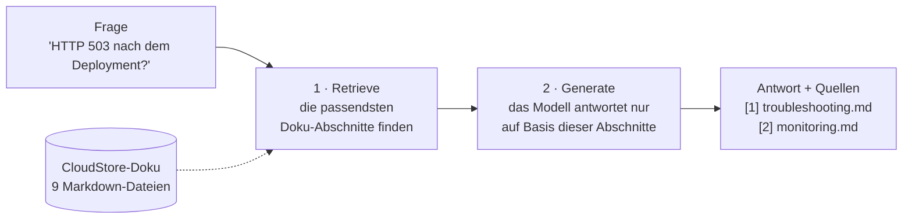
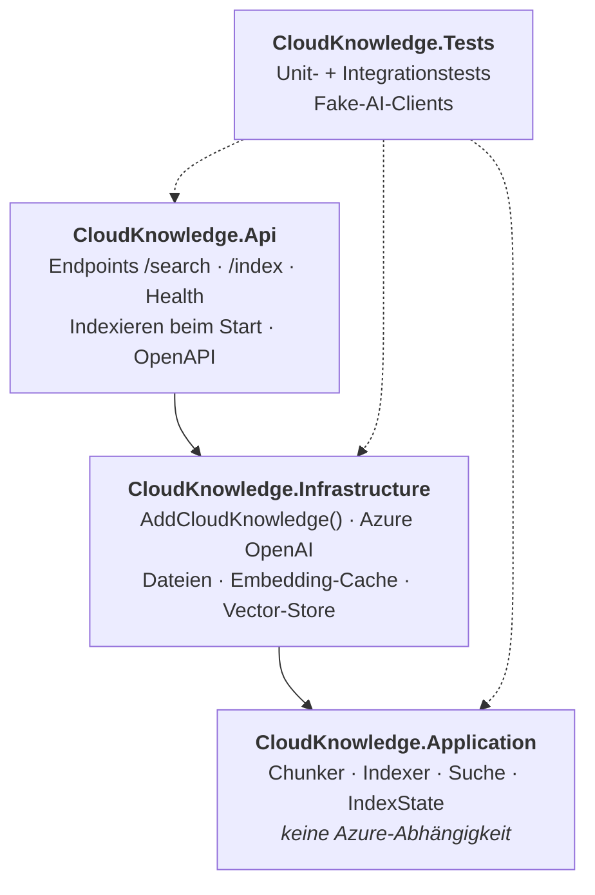
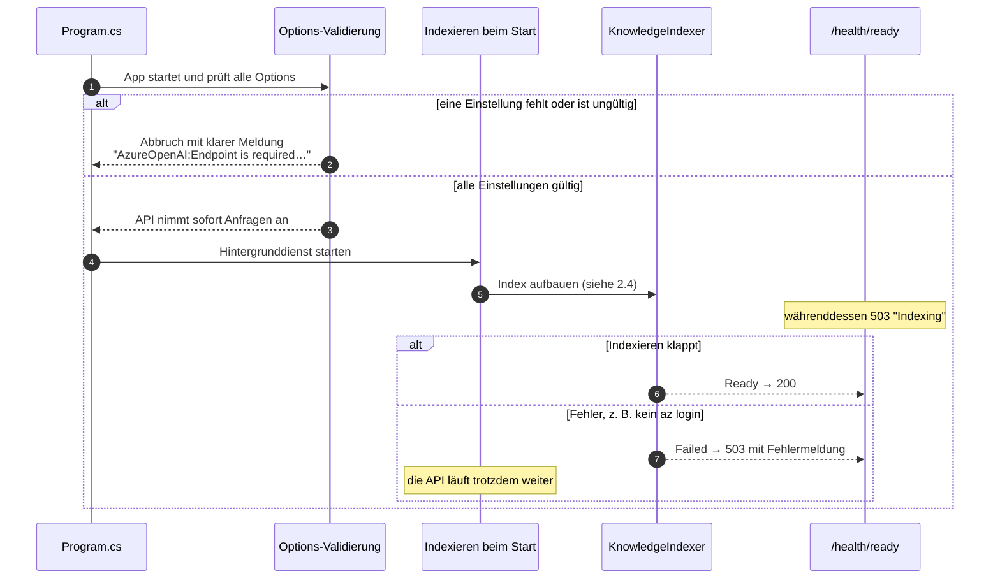
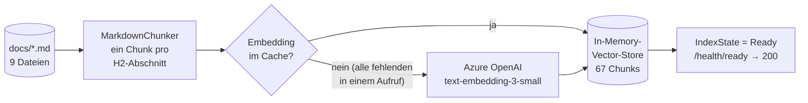
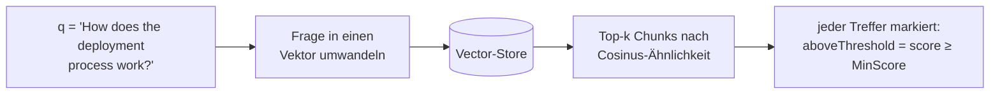
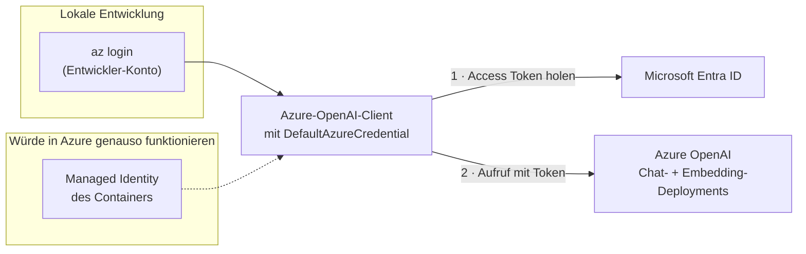
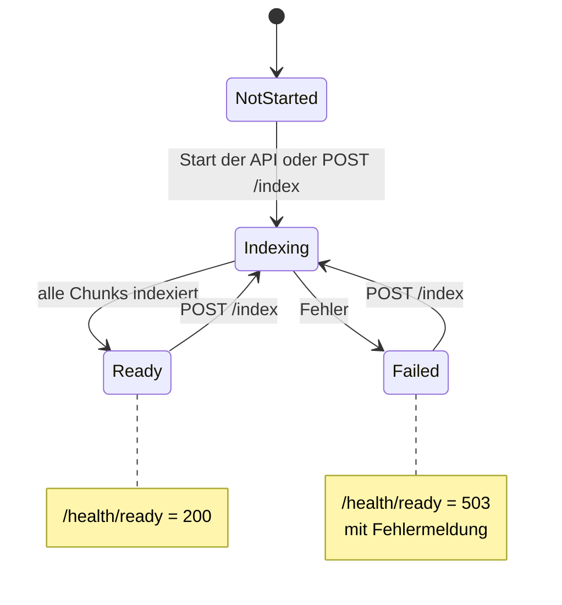
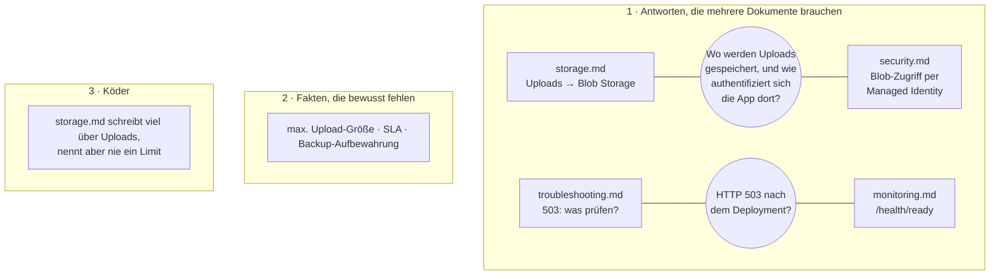
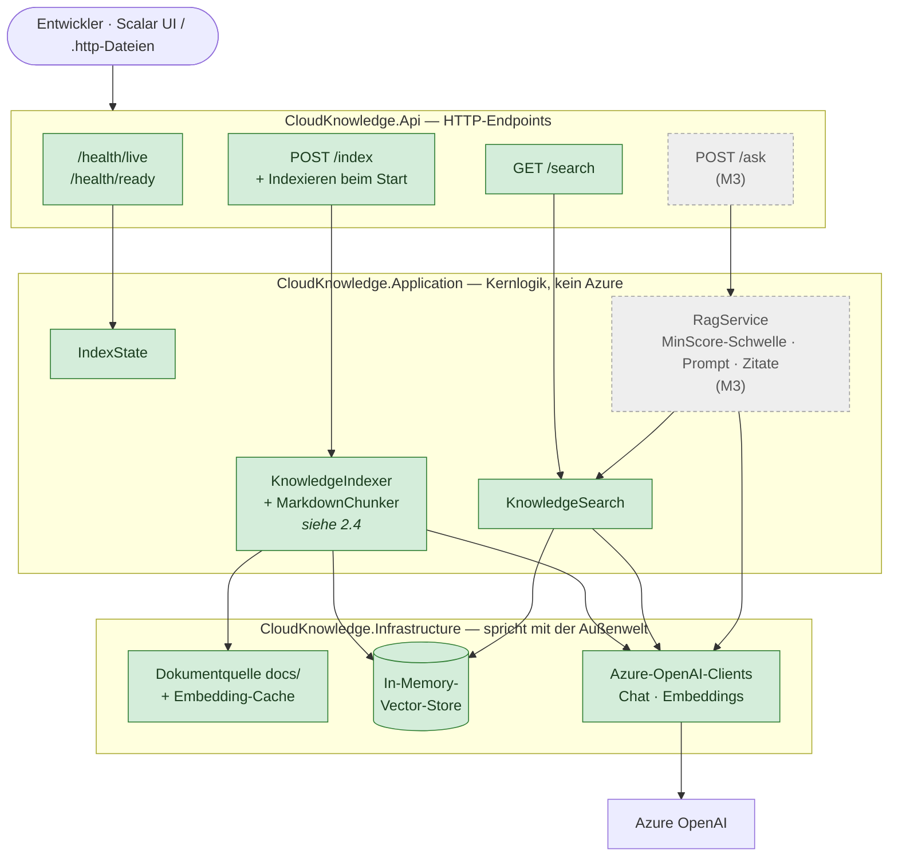
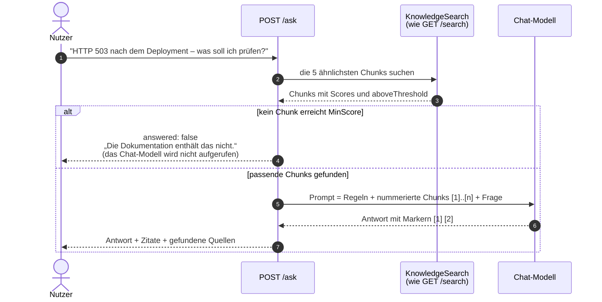

# CloudKnowledge.Api

Eine kleine **Retrieval-Augmented-Generation-Demo (RAG)** mit ASP.NET Core und Azure OpenAI.

Die API beantwortet technische Fragen zu einem fiktiven SaaS-Produkt namens **CloudStore**. Sie antwortet
ausschließlich auf Basis einer lokalen Markdown-Wissensbasis, nicht aus dem allgemeinen Wissen des Modells,
und zeigt zu jeder Antwort, aus welchen Dokumenten sie stammt.

> **Stand: Phase 1, Meilenstein M2 (Retrieval) umgesetzt.** Die API baut beim Start einen durchsuchbaren Index
> aus der Dokumentation und beantwortet Suchanfragen über `GET /api/knowledge/search`. Offen ist noch der erste Lauf
> gegen ein echtes Azure OpenAI. Antwortgenerierung (M3) und Evaluation (M4) folgen. Dieses README beschreibt
> sowohl den **heutigen Stand** als auch das **Ziel** am Ende von Phase 1, damit man beides vergleichen kann.

- [`SPEC.md`](SPEC.md): die vollständige Spezifikation und maßgebliche Quelle.
- [`tickets/`](tickets/README.md): die Umsetzungs-Tickets, das Validation log und das Replanning log.
- [`CLAUDE.md`](CLAUDE.md): die spec-getriebene Arbeitsweise.

---

## 1. Die Idee in einem Bild

Ein Sprachmodell formuliert gute Antworten, kennt aber *unsere* Dokumentation nicht. RAG löst das: Bevor das
Modell antwortet, **sucht** die API die passenden Stellen in der Dokumentation heraus und gibt sie dem Modell
als einzige Quelle mit.



Retrieval und Generierung sind zwei getrennte Schritte, und die API wird sie auch getrennt anbieten:
`/search` zeigt nur, was gefunden wurde, `/ask` erzeugt zusätzlich eine Antwort.

---

## 2. Aktuelle Architektur (nach M2)

### 2.1 Was es gibt und was es tut

| Baustein | Stand | Aufgabe |
|---|---|---|
| Solution mit 3 Projekten und Tests | ✅ gebaut | Teilt den Code in klare Schichten (siehe 2.2) |
| Konfiguration (Options-Klassen) | ✅ gebaut | Liest die Einstellungen und **bricht den Start ab**, wenn eine fehlt oder ungültig ist |
| Wissensbasis `docs/` + Guard-Test | ✅ gebaut | 9 CloudStore-Dokumente mit gezielt eingebauten Testfällen |
| Chunker | ✅ gebaut | Zerlegt jedes Dokument in Abschnitte (ein Chunk pro H2-Überschrift, heute 67 Chunks) |
| Embedding-Cache | ✅ gebaut | Merkt sich berechnete Vektoren in einer JSON-Datei, damit Azure jeden Text nur einmal sieht |
| Indexer + Vector-Store | ✅ gebaut | Baut beim Start und auf Anfrage den durchsuchbaren Index im Speicher |
| Health-Endpoints | ✅ gebaut | `/health/ready` wird grün, sobald der Index steht |
| `GET /search`, `POST /index` | ✅ gebaut | Suche ohne Sprachmodell, Index neu aufbauen |
| OpenAPI + Scalar UI | ✅ gebaut | API-Dokumentation im Browser (nur in Development) |
| Lauf gegen echtes Azure OpenAI | ⏳ offen | Demo-Schritt 2 mit echten Embeddings, liefert die ersten echten Scores |
| `/ask`, Evaluation | ⏳ geplant | Meilensteine M3 und M4 |

### 2.2 Projekte und ihre Abhängigkeiten

Der Code ist auf drei Projekte verteilt. Die Pfeile bedeuten „nutzt“. Die wichtigste Regel: **Application
weiß nichts von Azure.** Sie kennt nur Abstraktionen, die `Infrastructure` mit echter Technik füllt. Deshalb
lässt sich die Kernlogik ohne Cloud-Zugang testen, und ein Test prüft diese Regel.



| Projekt | Enthält heute |
|---|---|
| `src/CloudKnowledge.Api` | `Program.cs`, `Endpoints/KnowledgeEndpoints.cs`, `Indexing/KnowledgeIndexingService.cs`, `Health/*`, `CloudKnowledge.Api.http` |
| `src/CloudKnowledge.Application` | `Configuration/*Options.cs`, `Chunking/MarkdownChunker.cs`, `Indexing/` (`IndexState`, `KnowledgeIndexer`, `EmbeddingService`, `KnowledgeChunk`, Schnittstellen), `Search/KnowledgeSearch.cs` |
| `src/CloudKnowledge.Infrastructure` | `AddCloudKnowledge()`, `Knowledge/` (`FileDocumentSource`, `JsonEmbeddingCache`, `KnowledgePaths`) |
| `tests/CloudKnowledge.Tests` | Test-Host `CloudKnowledgeApiFactory`, Fakes, 106 Tests |

### 2.3 Was beim Start der API passiert



Weil die Konfiguration schon beim Start geprüft wird (**fail fast**), fällt eine fehlende Einstellung sofort
auf. Ein Fehler beim Indexieren bringt die API dagegen nicht zum Absturz: `/health/live` bleibt grün, und
`/health/ready` zeigt, was schiefging.

### 2.4 So wird der Index aufgebaut

Beim Start und bei jedem Aufruf von `POST /api/knowledge/index` wird die Dokumentation in durchsuchbare Vektoren
umgewandelt. Bereits berechnete Embeddings kommen aus dem Cache, ein Neustart kostet deshalb fast nichts.



- **Chunks:** Jeder Chunk ist ein H2-Abschnitt, zum Beispiel *troubleshooting.md > HTTP 503 after deployment*.
  Zu lange Abschnitte würden an Leerzeilen geteilt; bei den heutigen Dokumenten ist das nie nötig.
- **Cache:** Der Schlüssel ist ein Hash aus Deployment-Name und Text. Wechselt das Embedding-Modell, wird
  automatisch neu berechnet.
- **Neu indexieren:** Die Collection wird geleert und neu gefüllt. Solange liefern `/search` und `/health/ready`
  503. Mit Cache dauert das Bruchteile einer Sekunde. Läuft schon ein Durchlauf, antwortet `POST /index` mit 409.

### 2.5 So funktioniert die Suche (`GET /search`)

Die Suche ist der **Retrieval-Teil** von RAG, ganz ohne Sprachmodell. Sie zeigt, was `/ask` später dem Modell
mitgeben wird.



```json
{ "query": "How does the deployment process work?",
  "minScore": 0.0,
  "results": [ { "document": "deployment.md", "section": "Pipeline stages", "score": 0.62,
                 "aboveThreshold": true, "content": "..." } ] }
```

Die Treffer kommen **unabhängig** von `MinScore` zurück, sind aber markiert. So lässt sich die Schwelle später
anhand echter Scores einstellen. (Die Zahlen oben sind ein Beispiel; echte Scores gibt es erst mit Azure.)

### 2.6 Konfiguration

Alle Einstellungen sind typisierte Klassen und werden beim Start geprüft:

| Abschnitt | Einstellungen | Prüfung |
|---|---|---|
| `AzureOpenAI` | `Endpoint`, `ChatDeployment`, `EmbeddingDeployment` | Pflichtfelder, Endpoint muss `https` sein |
| `Rag` | `TopK` (5), `MinScore` (0.0) | 1–20, 0.0–1.0 |
| `Chunking` | `MaxTokens` (400) | 50–2000 |
| `Knowledge` | `DocsPath`, `EmbeddingCachePath`, `IndexOnStartup` (true) | Pflichtfelder |

Die echten Werte (Endpoint und Deployment-Namen) liegen als **User Secrets** auf dem Entwicklerrechner und
werden nie committet. `appsettings.json` enthält nur leere Werte und Standardwerte.

`docs/` wird beim Build in den Ausgabeordner kopiert. Relative Pfade gelten ab diesem Ordner, deshalb finden
API und Tests dieselben Dateien, egal aus welchem Verzeichnis sie gestartet werden.

### 2.7 Authentifizierung bei Azure OpenAI: ohne Keys

Die API verwendet keinen API-Key. Sie weist sich über **Microsoft Entra ID** mit `DefaultAzureCredential`
aus. Auf dem Laptop ist das der `az login` des Entwicklers. In Azure würde derselbe Code ohne jede Änderung
eine **Managed Identity** verwenden.



Die angemeldete Identität braucht auf der Azure-OpenAI-Ressource die Rolle **Cognitive Services OpenAI User**.

### 2.8 Health-Endpoints und Index-Zustand

Die API hat zwei Health-Endpoints mit unterschiedlicher Bedeutung:

- **`/health/live`**: *Läuft der Prozess?* Solange die API läuft, immer 200.
- **`/health/ready`**: *Kann die API Fragen beantworten?* Nur 200, wenn der Wissensindex aufgebaut ist.

Die Antwort von `/health/ready` kommt aus `IndexState`, den der Indexer weiterschaltet:



Beispielantwort, sobald der Index steht:

```json
{ "status": "Healthy",
  "checks": [ { "name": "index", "status": "Healthy", "description": "Index ready with 67 chunks." } ] }
```

Das spiegelt das fiktive CloudStore wider, dessen eigene `monitoring.md` dasselbe Live/Ready-Muster beschreibt.

### 2.9 Die Wissensbasis

`docs/` beschreibt CloudStore, ein fiktives SaaS für Dokumentenverwaltung (Angular, ASP.NET Core, PostgreSQL,
Blob Storage, Container Apps, Entra ID). CloudStore existiert nur in diesen Dokumenten. Die Dokumente sind auf
Englisch und bewusst so geschrieben, dass die Demo drei Dinge zeigen kann:



Ein **Guard-Test** (`KnowledgeBaseTests`) stellt sicher, dass die fehlenden Fakten fehlen und die verteilten
Fakten verteilt bleiben. Schreibt jemand „Files up to 100 MB…“ in die Doku, schlägt der Test fehl und nennt
die Datei.

---

## 3. Zielarchitektur (Ende von Phase 1)

### 3.1 Komponenten

Grüne Teile gibt es schon (M1 und M2). Graue Teile sind noch geplant, in Klammern steht der Meilenstein, der sie bringt.
Die Pfeile bedeuten „ruft auf“ oder „nutzt“.



### 3.2 So wird eine Frage beantwortet (M3)

`/ask` nutzt für die Suche genau dieselbe `KnowledgeSearch` wie `/search`. Was `/search` zeigt, ist also genau das,
was das Modell zu sehen bekommt.



Es gibt **zwei Schutzschichten gegen Halluzinationen**:

1. **Deterministisch:** Wird nichts Passendes gefunden, wird das Modell gar nicht erst gefragt.
2. **Anweisung:** Der Prompt verlangt, dass das Modell nur den mitgegebenen Kontext nutzt und es offen sagt,
   wenn die Antwort dort nicht steht.

### 3.3 Ist und Ziel im Überblick

| Bereich | Heute (M2) | Ziel (Ende Phase 1) | Meilenstein |
|---|---|---|---|
| Solution-Struktur | Api, Application, Infrastructure, Tests | + `CloudKnowledge.Eval` | M4 |
| Konfiguration | typisiert, beim Start geprüft ✅ | unverändert | ✅ |
| Azure OpenAI | Embeddings angebunden (Lauf gegen echtes Azure offen) | + Chat | M3 |
| Health | live ✅, ready 200 nach dem Indexieren ✅ | unverändert | ✅ |
| Wissensbasis | 9 Dokumente + Guard-Test ✅ | unverändert | ✅ |
| Chunking | ein Chunk pro H2-Abschnitt, 67 Chunks ✅ | unverändert | ✅ |
| Vector-Store | In-Memory (VectorData-Abstraktion) ✅ | unverändert | ✅ |
| Endpoints | Health, `/search`, `/index` ✅ | + `/ask` | M3 |
| API-Doku | OpenAPI + Scalar UI ✅ | unverändert | ✅ |
| Schutz vor Halluzinationen | `MinScore` markiert Suchtreffer (Platzhalter 0.0) | `MinScore`-Schwelle + Prompt-Regeln + Zitate | M3 |
| Qualitätsmessung | keine | Recall@k, kalibrierter `MinScore` | M4 |

---

## 4. Lokal starten

**Voraussetzungen:** .NET 10 SDK, Azure CLI und eine Azure-OpenAI-Ressource mit einem Chat-Deployment und
einem `text-embedding-3-small`-Deployment. Dein Konto braucht auf dieser Ressource die Rolle
**Cognitive Services OpenAI User**.

```bash
az login

dotnet user-secrets set "AzureOpenAI:Endpoint" "https://<deine-ressource>.openai.azure.com/" --project src/CloudKnowledge.Api
dotnet user-secrets set "AzureOpenAI:ChatDeployment" "<dein-chat-deployment>" --project src/CloudKnowledge.Api

dotnet build
dotnet test          # ruft nie Azure auf
dotnet run --project src/CloudKnowledge.Api
```

Die API läuft auf `http://localhost:5210`. Nach dem Indexieren (wenige Sekunden) liefert `/health/ready` 200.
Die Demo-Anfragen stehen in [`src/CloudKnowledge.Api/CloudKnowledge.Api.http`](src/CloudKnowledge.Api/CloudKnowledge.Api.http),
die API-Dokumentation zum Ausprobieren unter `http://localhost:5210/scalar`.

`POST /api/knowledge/index` hat **keine Authentifizierung**: Die API ist nur für den lokalen Betrieb gedacht.

---

## 5. Die wichtigsten Entscheidungen bisher

| Entscheidung | Warum |
|---|---|
| Läuft nur lokal, kein Deployment nach Azure | Hält den Umfang klein. Managed Identity wird erklärt, nicht deployt. |
| `DefaultAzureCredential`, keine API-Keys | Keine Secrets im Repo; derselbe Code funktioniert lokal und in Azure. |
| Drei Projekte, `Application` ohne Azure | Die Kernlogik ist ohne Cloud-Zugang testbar. |
| Konfiguration beim Start prüfen | Fehler fallen sofort auf, mit klarer Meldung. |
| Getrennte Live- und Ready-Endpoints | „Prozess läuft“ und „kann Fragen beantworten“ sind zwei verschiedene Dinge. |
| Wissensbasis mit verteilten, fehlenden und Köder-Fakten | Zeigt Retrieval über mehrere Dokumente und wie das System mit unbeantwortbaren Fragen umgeht. |
| Guard-Test für die Wissensbasis | Die Demo-Fälle können nicht unbemerkt kaputtgehen. |
| Suche (`/search`) getrennt von der Antwort (`/ask`) | Retrieval lässt sich zeigen und messen, bevor ein Sprachmodell beteiligt ist. |
| Embedding-Cache mit Deployment-Name im Schlüssel | Neustarts kosten nichts; ein anderes Modell rechnet automatisch neu. |
| Neu indexieren = leeren und neu füllen, solange 503 | Mit Cache dauert das Bruchteile einer Sekunde; einfacher als ein Austausch im Hintergrund. |
| Tests nutzen standardmäßig Fake-AI-Clients | Kein Test ruft Azure auf, auch nicht das Indexieren beim Start. |
| Preview-Connector für den Vector-Store, Abstraktion auf seine Version gepinnt | Stabile Schnittstelle, austauschbarer Connector; die neueste Abstraktion ist mit ihm nicht kompatibel. |

Alle Entscheidungen, auch die geplanten, stehen im [Decision Log in SPEC.md](SPEC.md#20-decision-log).
