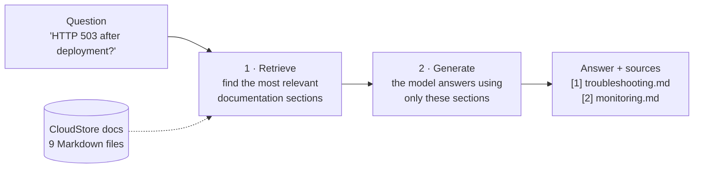
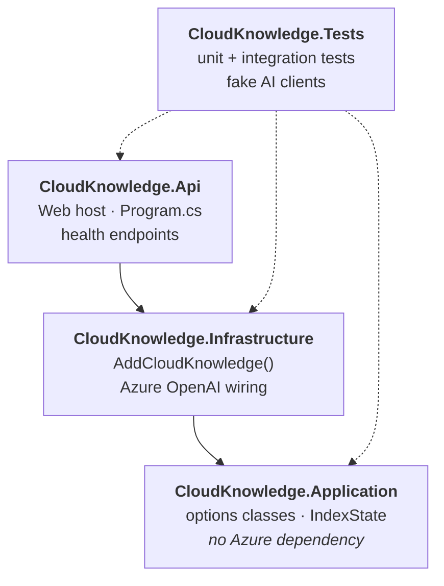
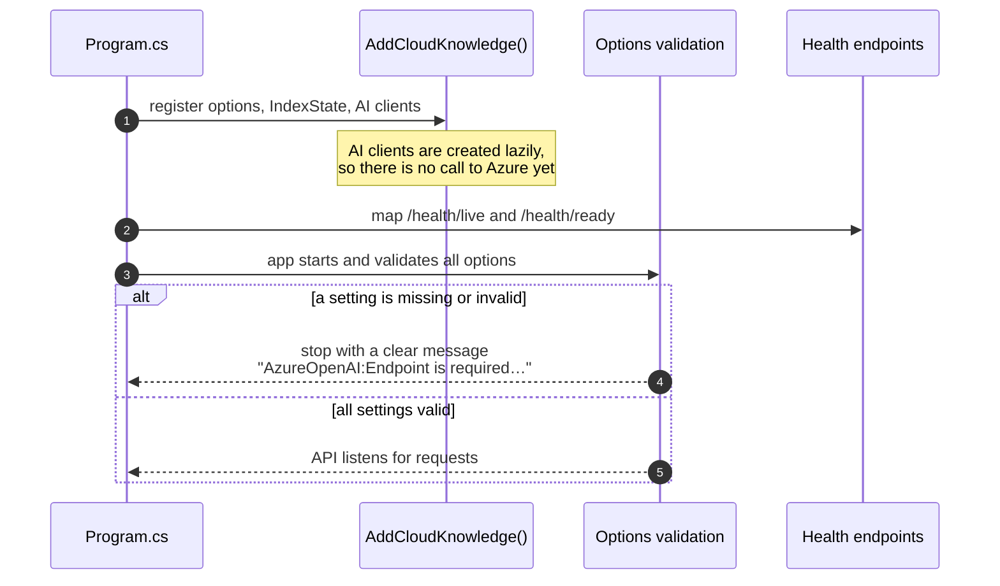
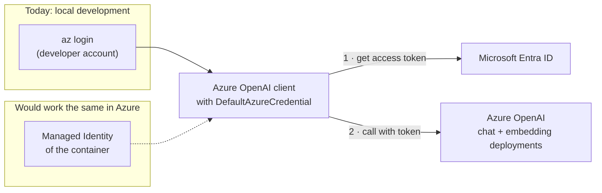
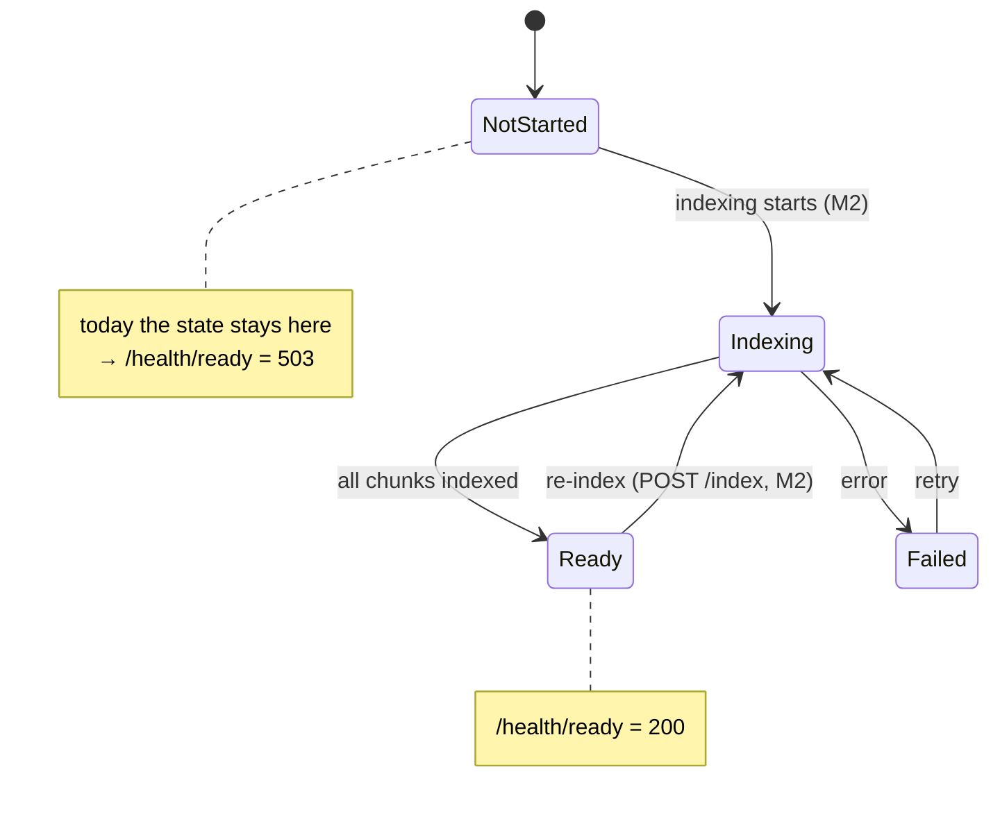
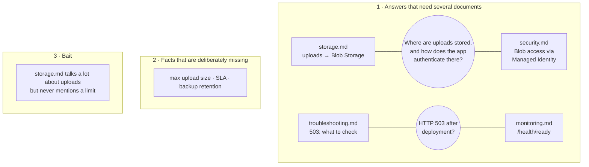
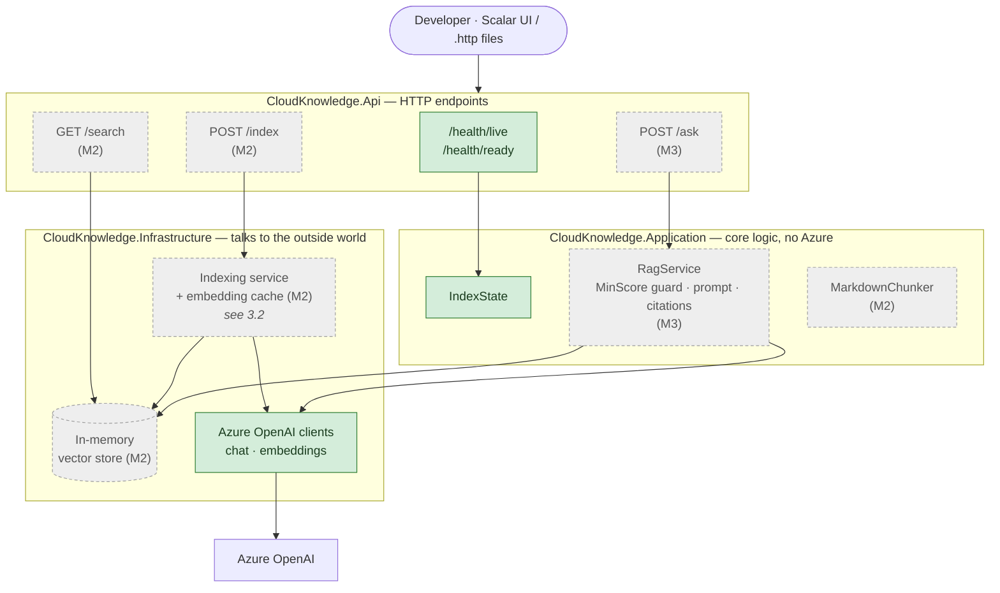
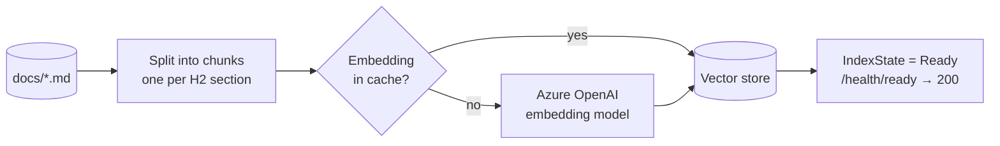
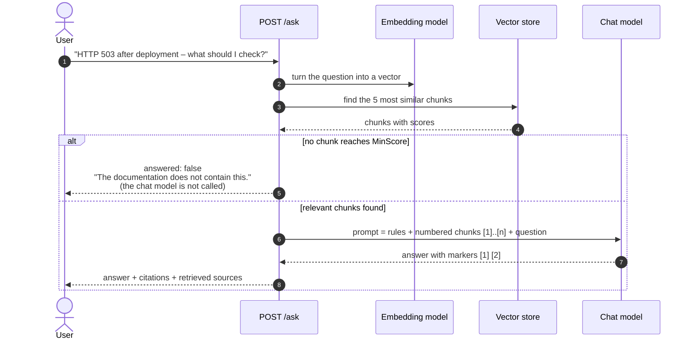

# CloudKnowledge.Api

A small **Retrieval Augmented Generation (RAG)** demo built with ASP.NET Core and Azure OpenAI.

The API answers technical questions about a fictional SaaS product called **CloudStore**. It answers only
from a local Markdown knowledge base, not from the model's general knowledge, and it shows which documents
each answer comes from.

> **Status: Phase 1, milestone M1 (Foundation) done.** The skeleton, configuration, Azure OpenAI wiring,
> health endpoints and knowledge base exist. Retrieval (M2), answer generation (M3) and evaluation (M4) are
> still to come. This README describes both what exists **today** and the **target** at the end of Phase 1,
> so the two can be compared.

- [`SPEC.md`](SPEC.md) is the full specification and source of truth.
- [`tickets/`](tickets/README.md) contains the implementation tickets, the validation log and the replanning log.
- [`CLAUDE.md`](CLAUDE.md) describes the spec-driven way of working.

---

## 1. The idea in one picture

A language model answers well, but it does not know *our* documentation. RAG fixes that. Before the model
answers, the API **looks up** the relevant pieces of documentation and gives them to the model as its only
source.



Retrieval and generation are two separate steps, and the API will expose them separately:
`/search` shows only what was found, and `/ask` also produces an answer.

---

## 2. Current architecture (after M1)

### 2.1 What exists and what it does

| Part | Status | What it does |
|---|---|---|
| Solution with 3 projects and tests | ✅ built | Keeps the code in clear layers (see 2.2) |
| Configuration (options classes) | ✅ built | Reads settings and **stops the app at startup** if one is missing or invalid |
| Azure OpenAI clients | ✅ registered, ⏳ not used yet | Chat and embedding clients are ready for M2 and M3 |
| Index state + health endpoints | ✅ built | `/health/live` and `/health/ready` report whether the API runs and whether it is ready |
| Knowledge base `docs/` | ✅ written and approved | 9 CloudStore documents with deliberate test cases |
| Guard test for the knowledge base | ✅ built | Makes sure later edits do not break the demo cases |
| Retrieval, `/search`, `/ask`, evaluation | ⏳ planned | Milestones M2–M4 |

### 2.2 Projects and their dependencies

The code is split into three projects. The arrows show "uses". The important rule is that **Application
knows nothing about Azure**, so the core logic can be tested without any cloud access.



| Project | Contains today |
|---|---|
| `src/CloudKnowledge.Api` | `Program.cs`, `Health/IndexReadinessHealthCheck.cs`, `Health/HealthEndpoints.cs` |
| `src/CloudKnowledge.Application` | `Configuration/*Options.cs`, `Indexing/IndexState.cs` |
| `src/CloudKnowledge.Infrastructure` | `ServiceCollectionExtensions.cs` with `AddCloudKnowledge()` |
| `tests/CloudKnowledge.Tests` | test host `CloudKnowledgeApiFactory`, fakes, 46 tests |

### 2.3 What happens when the API starts



Checking the configuration at startup (**fail fast**) means a missing setting shows up immediately, not on
the first user request.

### 2.4 Configuration

All settings are typed classes and are validated at startup:

| Section | Settings | Validation |
|---|---|---|
| `AzureOpenAI` | `Endpoint`, `ChatDeployment`, `EmbeddingDeployment` | required, endpoint must be `https` |
| `Rag` | `TopK` (5), `MinScore` (0.0) | 1–20, 0.0–1.0 |
| `Chunking` | `MaxTokens` (400) | 50–2000 |
| `Knowledge` | `DocsPath`, `EmbeddingCachePath` | required |

Real values (the endpoint and deployment names) live in **user secrets** on the developer machine and are
never committed. `appsettings.json` contains only empty values and defaults.

### 2.5 Authentication to Azure OpenAI: no keys

The API does not use an API key. It proves its identity with **Microsoft Entra ID** through
`DefaultAzureCredential`. On a laptop that is the developer's `az login`. In Azure, the same code would
use a **Managed Identity**, without any code change.



The signed-in identity needs the role **Cognitive Services OpenAI User** on the Azure OpenAI resource.

### 2.6 Health endpoints and index state

The API has two health endpoints with different meanings:

- **`/health/live`**: *Is the process running?* It is always 200 while the API runs.
- **`/health/ready`**: *Can the API answer questions?* It is 200 only when the knowledge index is built.

The readiness answer comes from `IndexState`. Today nothing builds an index yet, so the state stays
`NotStarted` and `/health/ready` correctly returns **503**. M2 adds the indexing that moves the state
forward.



Example response while not ready:

```json
{ "status": "Unhealthy",
  "checks": [ { "name": "index", "status": "Unhealthy", "description": "Index status: NotStarted." } ] }
```

This mirrors the fictional CloudStore, whose own `monitoring.md` describes the same live/ready pattern.

### 2.7 The knowledge base

`docs/` describes CloudStore, a fictional document-management SaaS (Angular, ASP.NET Core, PostgreSQL,
Blob Storage, Container Apps, Entra ID). CloudStore exists only in these documents. Its content is written
on purpose so that the demo can show three things:



A **guard test** (`KnowledgeBaseTests`) checks that the missing facts stay missing and that the split facts
stay split. If someone writes "Files up to 100 MB…" into the docs, the test fails and names the file.

---

## 3. Target architecture (end of Phase 1)

### 3.1 Components

Green parts exist today. Grey parts are still planned, and the label shows the milestone that adds them.
Arrows mean "calls" or "uses".



### 3.2 How the index is built (M2)

At startup, and whenever `POST /index` is called, the documentation is turned into searchable vectors.
Embeddings that were computed before are loaded from a local cache, so a restart costs almost nothing.



Each chunk is one H2 section of a document, for example *troubleshooting.md > HTTP 503 after deployment*.
Whole sections produce precise search hits and readable source references.

### 3.3 How a question will be answered (M3)



There are **two guards against hallucination**:

1. **Deterministic:** if nothing relevant is found, the model is not asked at all.
2. **Instruction:** the prompt tells the model to use only the given context and to say so when the answer
   is not in it.

### 3.4 Current vs. target at a glance

| Area | Today (M1) | Target (end of Phase 1) | Milestone |
|---|---|---|---|
| Solution structure | Api, Application, Infrastructure, Tests | + `CloudKnowledge.Eval` | M4 |
| Configuration | typed, validated at startup | unchanged | ✅ |
| Azure OpenAI | clients registered, not called | embeddings (M2), chat (M3) | M2, M3 |
| Health | live ✅, ready always 503 | ready turns 200 after indexing | M2 |
| Knowledge base | 9 docs + guard test ✅ | unchanged | ✅ |
| Chunking | none | one chunk per H2 section | M2 |
| Vector store | none | in-memory (VectorData abstraction) | M2 |
| Endpoints | health only | `/search`, `/index`, `/ask` | M2, M3 |
| API docs | none | OpenAPI + Scalar UI | M2 |
| Hallucination guard | none | `MinScore` + prompt rules + citations | M3 |
| Quality measurement | none | Recall@k, calibrated `MinScore` | M4 |

---

## 4. Running it locally

**Prerequisites:** .NET 10 SDK, Azure CLI, and an Azure OpenAI resource with a chat deployment and a
`text-embedding-3-small` deployment. Your account needs the role **Cognitive Services OpenAI User** on
that resource.

```bash
az login

dotnet user-secrets set "AzureOpenAI:Endpoint" "https://<your-resource>.openai.azure.com/" --project src/CloudKnowledge.Api
dotnet user-secrets set "AzureOpenAI:ChatDeployment" "<your-chat-deployment>" --project src/CloudKnowledge.Api

dotnet build
dotnet test          # never calls Azure
dotnet run --project src/CloudKnowledge.Api
```

Then open `/health/live` (200) and `/health/ready` (503 until M2 adds indexing).

---

## 5. Key decisions so far

| Decision | Why |
|---|---|
| Runs locally only, no Azure deployment | Keeps the scope small. Managed Identity is explained, not deployed. |
| `DefaultAzureCredential`, no API keys | No secrets in the repo; the same code works locally and in Azure. |
| Three projects, `Application` free of Azure | Core logic is testable without cloud access. |
| Validate configuration at startup | Errors appear immediately and with a clear message. |
| Separate live and ready endpoints | "Process runs" and "can answer questions" are different things. |
| Knowledge base with split, missing and bait facts | Shows multi-document retrieval and how the system handles questions it cannot answer. |
| Guard test for the knowledge base | Demo cases cannot break silently. |

All decisions, including the planned ones, are in the [decision log in SPEC.md](SPEC.md#20-decision-log).
