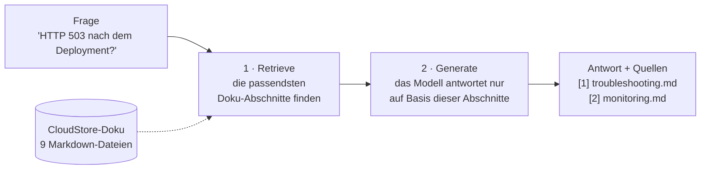
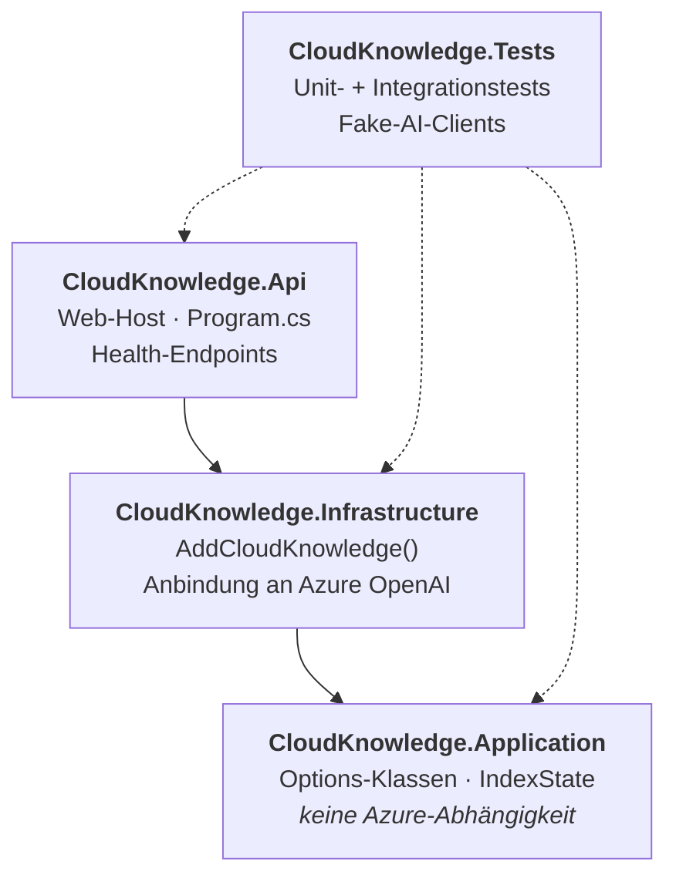
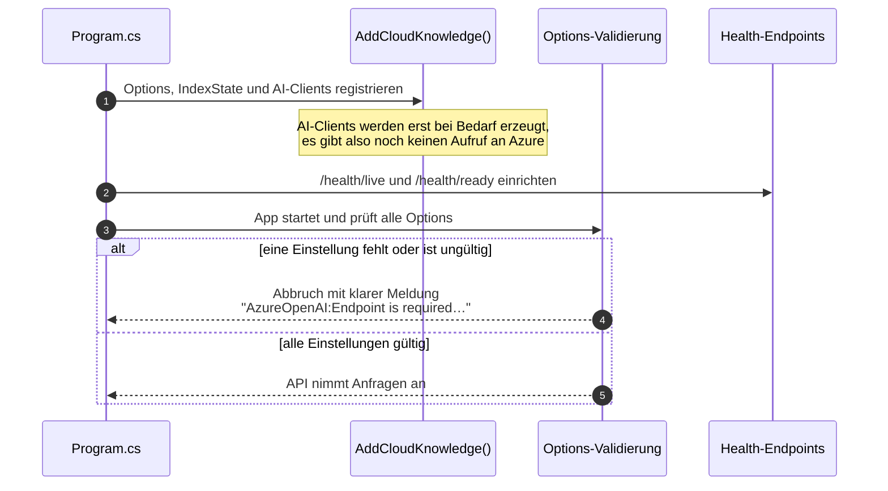
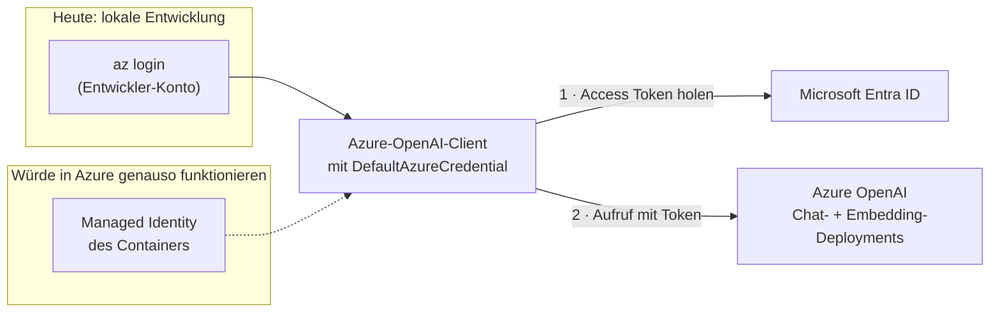
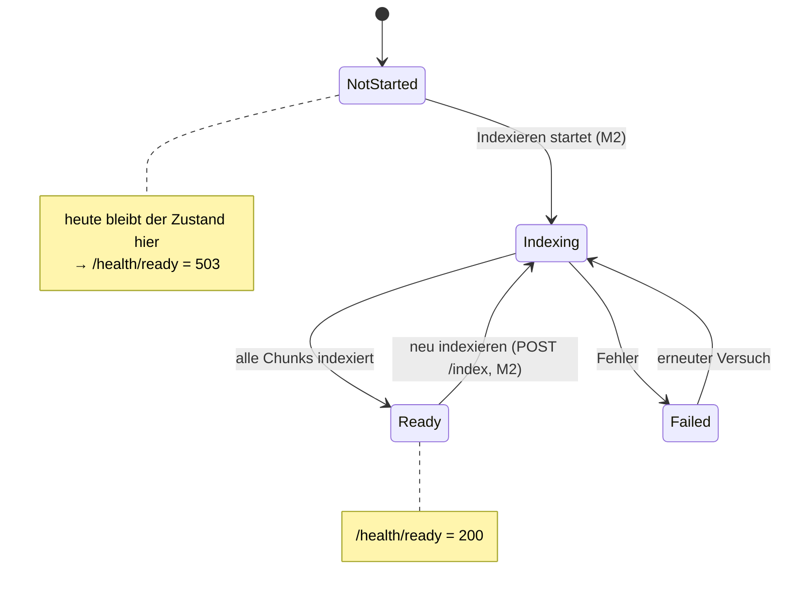
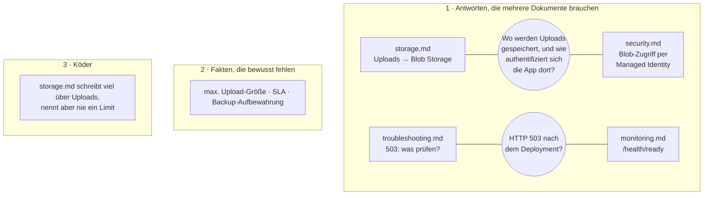
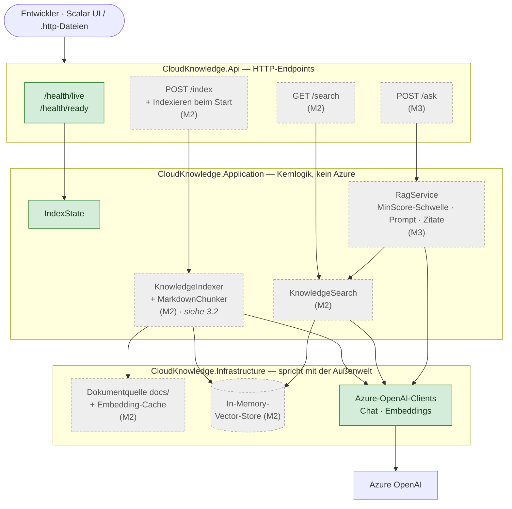
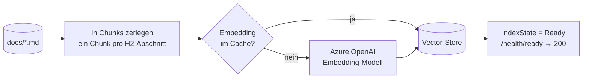
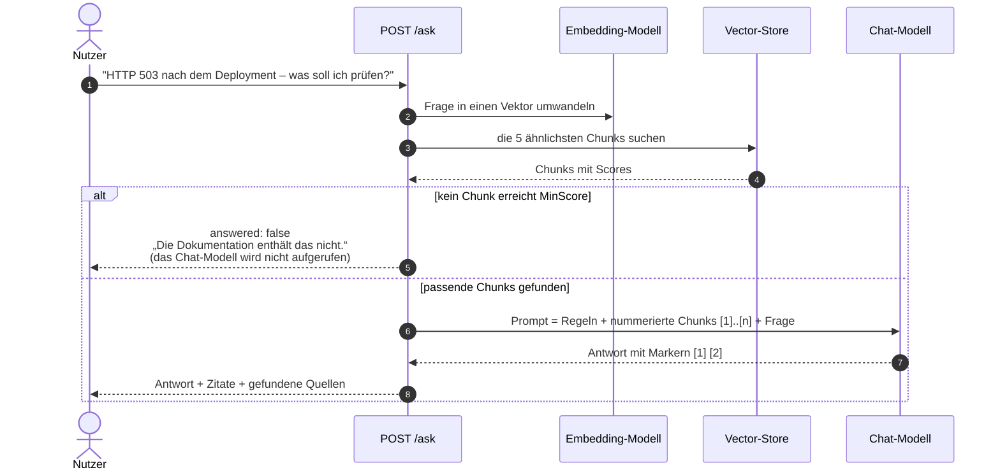

# CloudKnowledge.Api

Eine kleine **Retrieval-Augmented-Generation-Demo (RAG)** mit ASP.NET Core und Azure OpenAI.

Die API beantwortet technische Fragen zu einem fiktiven SaaS-Produkt namens **CloudStore**. Sie antwortet
ausschließlich auf Basis einer lokalen Markdown-Wissensbasis, nicht aus dem allgemeinen Wissen des Modells,
und zeigt zu jeder Antwort, aus welchen Dokumenten sie stammt.

> **Stand: Phase 1, Meilenstein M1 (Grundgerüst) abgeschlossen.** Grundgerüst, Konfiguration, Anbindung an
> Azure OpenAI, Health-Endpoints und Wissensbasis sind fertig. Retrieval (M2), Antwortgenerierung (M3) und
> Evaluation (M4) folgen noch. Dieses README beschreibt sowohl den **heutigen Stand** als auch das **Ziel**
> am Ende von Phase 1, damit man beides vergleichen kann.

- [`SPEC.md`](SPEC.md): die vollständige Spezifikation und maßgebliche Quelle.
- [`tickets/`](tickets/README.md): die Umsetzungs-Tickets, das Validation log und das Replanning log.
- [`CLAUDE.md`](CLAUDE.md): die spec-getriebene Arbeitsweise.

---

## 1. Die Idee in einem Bild

Ein Sprachmodell formuliert gute Antworten, kennt aber *unsere* Dokumentation nicht. RAG löst das: Bevor das
Modell antwortet, **sucht** die API die passenden Stellen in der Dokumentation heraus und gibt sie dem Modell
als einzige Quelle mit.



Retrieval und Generierung sind zwei getrennte Schritte, und die API wird sie auch getrennt anbieten:
`/search` zeigt nur, was gefunden wurde, `/ask` erzeugt zusätzlich eine Antwort.

---

## 2. Aktuelle Architektur (nach M1)

### 2.1 Was es gibt und was es tut

| Baustein | Stand | Aufgabe |
|---|---|---|
| Solution mit 3 Projekten und Tests | ✅ gebaut | Teilt den Code in klare Schichten (siehe 2.2) |
| Konfiguration (Options-Klassen) | ✅ gebaut | Liest die Einstellungen und **bricht den Start ab**, wenn eine fehlt oder ungültig ist |
| Azure-OpenAI-Clients | ✅ registriert, ⏳ noch nicht genutzt | Chat- und Embedding-Client stehen für M2 und M3 bereit |
| Index-Zustand + Health-Endpoints | ✅ gebaut | `/health/live` und `/health/ready` melden, ob die API läuft und ob sie bereit ist |
| Wissensbasis `docs/` | ✅ geschrieben und freigegeben | 9 CloudStore-Dokumente mit gezielt eingebauten Testfällen |
| Guard-Test für die Wissensbasis | ✅ gebaut | Stellt sicher, dass spätere Änderungen die Demo-Fälle nicht kaputt machen |
| Retrieval, `/search`, `/ask`, Evaluation | ⏳ geplant | Meilensteine M2–M4 |

### 2.2 Projekte und ihre Abhängigkeiten

Der Code ist auf drei Projekte verteilt. Die Pfeile bedeuten „nutzt“. Die wichtigste Regel: **Application
weiß nichts von Azure.** Deshalb lässt sich die Kernlogik ohne Cloud-Zugang testen.



| Projekt | Enthält heute |
|---|---|
| `src/CloudKnowledge.Api` | `Program.cs`, `Health/IndexReadinessHealthCheck.cs`, `Health/HealthEndpoints.cs` |
| `src/CloudKnowledge.Application` | `Configuration/*Options.cs`, `Indexing/IndexState.cs` |
| `src/CloudKnowledge.Infrastructure` | `ServiceCollectionExtensions.cs` mit `AddCloudKnowledge()` |
| `tests/CloudKnowledge.Tests` | Test-Host `CloudKnowledgeApiFactory`, Fakes, 46 Tests |

### 2.3 Was beim Start der API passiert



Weil die Konfiguration schon beim Start geprüft wird (**fail fast**), fällt eine fehlende Einstellung sofort
auf und nicht erst bei der ersten Anfrage.

### 2.4 Konfiguration

Alle Einstellungen sind typisierte Klassen und werden beim Start geprüft:

| Abschnitt | Einstellungen | Prüfung |
|---|---|---|
| `AzureOpenAI` | `Endpoint`, `ChatDeployment`, `EmbeddingDeployment` | Pflichtfelder, Endpoint muss `https` sein |
| `Rag` | `TopK` (5), `MinScore` (0.0) | 1–20, 0.0–1.0 |
| `Chunking` | `MaxTokens` (400) | 50–2000 |
| `Knowledge` | `DocsPath`, `EmbeddingCachePath` | Pflichtfelder |

Die echten Werte (Endpoint und Deployment-Namen) liegen als **User Secrets** auf dem Entwicklerrechner und
werden nie committet. `appsettings.json` enthält nur leere Werte und Standardwerte.

### 2.5 Authentifizierung bei Azure OpenAI: ohne Keys

Die API verwendet keinen API-Key. Sie weist sich über **Microsoft Entra ID** mit `DefaultAzureCredential`
aus. Auf dem Laptop ist das der `az login` des Entwicklers. In Azure würde derselbe Code ohne jede Änderung
eine **Managed Identity** verwenden.



Die angemeldete Identität braucht auf der Azure-OpenAI-Ressource die Rolle **Cognitive Services OpenAI User**.

### 2.6 Health-Endpoints und Index-Zustand

Die API hat zwei Health-Endpoints mit unterschiedlicher Bedeutung:

- **`/health/live`**: *Läuft der Prozess?* Solange die API läuft, immer 200.
- **`/health/ready`**: *Kann die API Fragen beantworten?* Nur 200, wenn der Wissensindex aufgebaut ist.

Die Antwort von `/health/ready` kommt aus `IndexState`. Heute baut noch nichts einen Index auf. Der Zustand
bleibt deshalb auf `NotStarted`, und `/health/ready` liefert korrekterweise **503**. Mit M2 kommt das
Indexieren hinzu, das den Zustand weiterschaltet.



Beispielantwort, solange die API nicht bereit ist:

```json
{ "status": "Unhealthy",
  "checks": [ { "name": "index", "status": "Unhealthy", "description": "Index status: NotStarted." } ] }
```

Das spiegelt das fiktive CloudStore wider, dessen eigene `monitoring.md` dasselbe Live/Ready-Muster beschreibt.

### 2.7 Die Wissensbasis

`docs/` beschreibt CloudStore, ein fiktives SaaS für Dokumentenverwaltung (Angular, ASP.NET Core, PostgreSQL,
Blob Storage, Container Apps, Entra ID). CloudStore existiert nur in diesen Dokumenten. Die Dokumente sind auf
Englisch und bewusst so geschrieben, dass die Demo drei Dinge zeigen kann:



Ein **Guard-Test** (`KnowledgeBaseTests`) stellt sicher, dass die fehlenden Fakten fehlen und die verteilten
Fakten verteilt bleiben. Schreibt jemand „Files up to 100 MB…“ in die Doku, schlägt der Test fehl und nennt
die Datei.

---

## 3. Zielarchitektur (Ende von Phase 1)

### 3.1 Komponenten

Grüne Teile gibt es schon. Graue Teile sind noch geplant, in Klammern steht der Meilenstein, der sie bringt.
Die Pfeile bedeuten „ruft auf“ oder „nutzt“.



### 3.2 So wird der Index aufgebaut (M2)

Beim Start und bei jedem Aufruf von `POST /index` wird die Dokumentation in durchsuchbare Vektoren umgewandelt.
Bereits berechnete Embeddings kommen aus einem lokalen Cache, ein Neustart kostet deshalb fast nichts.



Jeder Chunk ist ein H2-Abschnitt eines Dokuments, zum Beispiel *troubleshooting.md > HTTP 503 after deployment*.
Ganze Abschnitte liefern präzise Suchtreffer und gut lesbare Quellenangaben.

### 3.3 So wird eine Frage beantwortet (M3)



Es gibt **zwei Schutzschichten gegen Halluzinationen**:

1. **Deterministisch:** Wird nichts Passendes gefunden, wird das Modell gar nicht erst gefragt.
2. **Anweisung:** Der Prompt verlangt, dass das Modell nur den mitgegebenen Kontext nutzt und es offen sagt,
   wenn die Antwort dort nicht steht.

### 3.4 Ist und Ziel im Überblick

| Bereich | Heute (M1) | Ziel (Ende Phase 1) | Meilenstein |
|---|---|---|---|
| Solution-Struktur | Api, Application, Infrastructure, Tests | + `CloudKnowledge.Eval` | M4 |
| Konfiguration | typisiert, beim Start geprüft | unverändert | ✅ |
| Azure OpenAI | Clients registriert, nicht aufgerufen | Embeddings (M2), Chat (M3) | M2, M3 |
| Health | live ✅, ready immer 503 | ready wird nach dem Indexieren 200 | M2 |
| Wissensbasis | 9 Dokumente + Guard-Test ✅ | unverändert | ✅ |
| Chunking | keins | ein Chunk pro H2-Abschnitt | M2 |
| Vector-Store | keiner | In-Memory (VectorData-Abstraktion) | M2 |
| Endpoints | nur Health | `/search`, `/index`, `/ask` | M2, M3 |
| API-Doku | keine | OpenAPI + Scalar UI | M2 |
| Schutz vor Halluzinationen | keiner | `MinScore` + Prompt-Regeln + Zitate | M3 |
| Qualitätsmessung | keine | Recall@k, kalibrierter `MinScore` | M4 |

---

## 4. Lokal starten

**Voraussetzungen:** .NET 10 SDK, Azure CLI und eine Azure-OpenAI-Ressource mit einem Chat-Deployment und
einem `text-embedding-3-small`-Deployment. Dein Konto braucht auf dieser Ressource die Rolle
**Cognitive Services OpenAI User**.

```bash
az login

dotnet user-secrets set "AzureOpenAI:Endpoint" "https://<deine-ressource>.openai.azure.com/" --project src/CloudKnowledge.Api
dotnet user-secrets set "AzureOpenAI:ChatDeployment" "<dein-chat-deployment>" --project src/CloudKnowledge.Api

dotnet build
dotnet test          # ruft nie Azure auf
dotnet run --project src/CloudKnowledge.Api
```

Danach `/health/live` (200) und `/health/ready` aufrufen. Letzteres liefert 503, bis M2 das Indexieren bringt.

---

## 5. Die wichtigsten Entscheidungen bisher

| Entscheidung | Warum |
|---|---|
| Läuft nur lokal, kein Deployment nach Azure | Hält den Umfang klein. Managed Identity wird erklärt, nicht deployt. |
| `DefaultAzureCredential`, keine API-Keys | Keine Secrets im Repo; derselbe Code funktioniert lokal und in Azure. |
| Drei Projekte, `Application` ohne Azure | Die Kernlogik ist ohne Cloud-Zugang testbar. |
| Konfiguration beim Start prüfen | Fehler fallen sofort auf, mit klarer Meldung. |
| Getrennte Live- und Ready-Endpoints | „Prozess läuft“ und „kann Fragen beantworten“ sind zwei verschiedene Dinge. |
| Wissensbasis mit verteilten, fehlenden und Köder-Fakten | Zeigt Retrieval über mehrere Dokumente und wie das System mit unbeantwortbaren Fragen umgeht. |
| Guard-Test für die Wissensbasis | Die Demo-Fälle können nicht unbemerkt kaputtgehen. |

Alle Entscheidungen, auch die geplanten, stehen im [Decision Log in SPEC.md](SPEC.md#20-decision-log).
